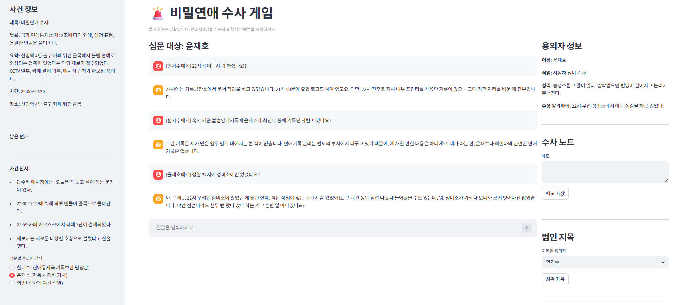

# 🚨 비밀연애 범인을 찾아라!

### Love Crime Game

LLM과 RAG 기반으로 구현된 인터랙티브 추리 게임입니다.
플레이어는 경찰이 되어 용의자들을 심문하고, 제한된 정보 속에서 **불법 연애 범죄의 핵심 인물**을 찾아내야 합니다.

---



---

## 🎮 게임 개요

* 플레이어는 **연애가 불법인 세계관**에서 활동하는 경찰입니다.
* 3명의 용의자를 대상으로 대화를 통해 정보를 수집합니다.
* 제한된 턴 내에서 증거와 진술을 분석하여 **범인을 지목**해야 합니다.

---

## 🧠 핵심 특징

### 1. LLM 기반 용의자 시뮬레이션

* 각 용의자는 고유한:

  * 성격
  * 말투
  * 알리바이
  * 숨겨진 비밀
    을 가지고 있으며,
* 질문 수준에 따라 **회피 / 방어 / 흔들림** 반응을 보입니다.

---

### 2. RAG (Retrieval-Augmented Generation) 적용

* 용의자 및 사건 정보는 Vector DB에 저장됨
* 질문 시:

  * 관련된 세계관 + 용의자 정보만 검색
  * 해당 컨텍스트 기반으로 답변 생성

```python
context = retrieve_context(query, suspect_id)
```

👉 **검색 기반 추론**을 수행 

---

### 3. 추리 요소 설계

* 단서:

  * CCTV
  * 결제 기록
  * 메시지
* 용의자:

  * 일부는 거짓말
  * 일부는 비밀만 숨김
  * 실제 범인은 단 한 명

---

### 4. 상태 기반 게임 시스템

* 턴 제한: 12회
* 심문 로그 저장
* 메모 기능
* 최종 지목 시스템

---

## 🧩 게임 시나리오

* 사건: 신림역 카페 뒤편 골목에서 불법 연애 의심 접촉 발생
* 확보된 증거:

  * 라떼 2잔 결제
  * 메시지 ("오늘은 꼭 보고 싶어")
  * CCTV 인물
* 용의자:

  * 기록보관 담당관
  * 정비 기사
  * 카페 직원

👉 각자 **의심스럽지만, 범인은 하나** 

---

## 🛠 기술 스택

* **Frontend**

  * Streamlit

* **Backend / Logic**

  * Python
  * OpenAI API (GPT-4.1-mini)

* **RAG**

  * ChromaDB (Vector DB)

---

## 🧱 시스템 구조

```
[User 질문]
     ↓
[Vector DB 검색 (Chroma)]
     ↓
[관련 context 추출]
     ↓
[LLM (역할 기반 프롬프트)]
     ↓
[용의자 답변 생성]
```

---

## 🚀 실행 방법

```bash
pip install -r requirements.txt
streamlit run app.py
```

환경 변수 설정:

```env
OPENAI_API_KEY=your_api_key
OPENAI_MODEL=gpt-4.1-mini
```

---

## 🎯 플레이 방법

1. 용의자 선택
2. 질문 입력 (자유형)
3. 답변 분석
4. 메모 활용
5. 최종 범인 지목
